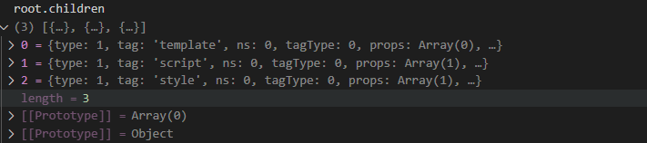
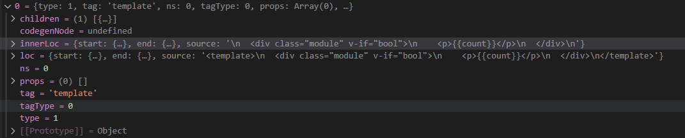
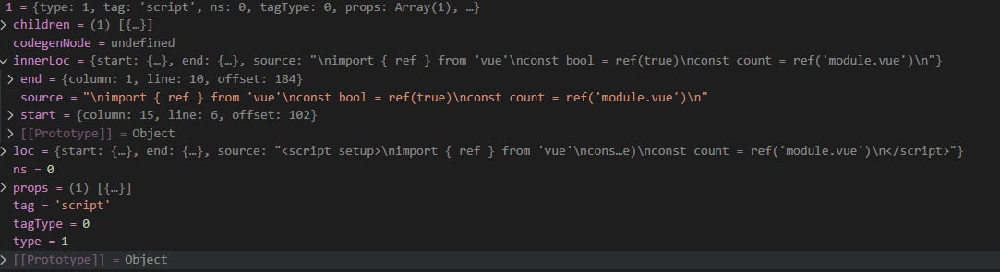
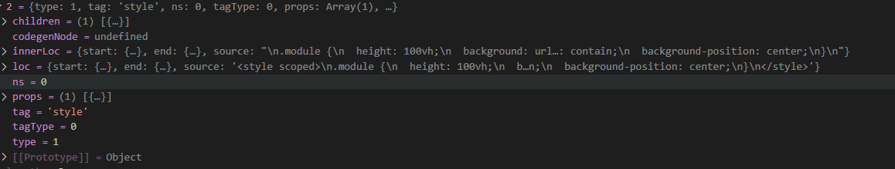
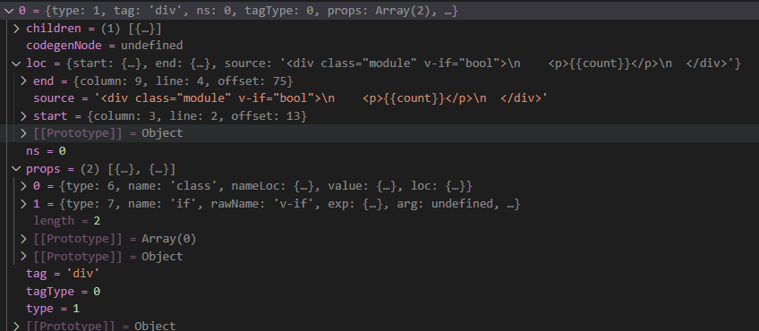
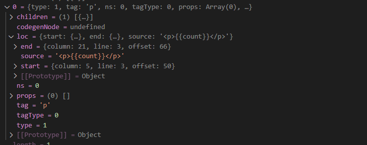
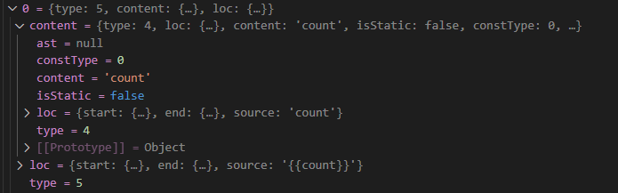

# vue-plugin
这章我们讲述`vue-plugin`插件是如何将`xxx.vue`组件转换成正常代码执行的，
也就是`vue-plugin`是如何工作的。总所周知，vue组件是由`template`、`script`和
`style`三个部分组成的。但是浏览器只能执行html、css和js代码，那么`xxx.vue`组件在浏览器是怎么执行的呢。
其实这里呢，也没有什么黑科技，原理就是`vue-plugin`会将`xxx.vue`组件转换成js代码和css代码，那么`template`
里面的代码呢，不知道你们有没有看过`import { h } from 'vue'`,h这个方法，它是用来创建vnode的，也就是用来创建
元素的。最后`template`里面的代码就会被转换成`h('div', 节点属性 ,[子节点])`,类似这种的嵌套结构。
先看个例子：
```vue
<template>
  <div class="module">
    <p>{{count}}</p>
  </div>
</template>
<script setup>
import { ref } from 'vue'
const count = ref('module.vue')
</script>
<style scoped>
.module {
  height: 100vh;
  background: url('@/assets/asset.png') no-repeat;
  background-size: contain;
  background-position: center;
}
</style>

```
转换后代码如下：

```js{5,21,35,41,46}
import { createHotContext as __vite__createHotContext } from "/@vite/client";
import.meta.hot = __vite__createHotContext("/module.vue");
import { ref } from "/node_modules/.vite/deps/vue.js?v=2a43e5a5"

//===============这里是<script>部分============
const _sfc_main = {
    __name: 'module',
    setup(__props, { expose: __expose }) {
        __expose();

        const count = ref('module.vue')

        const __returned__ = { count, ref }
        Object.defineProperty(__returned__, '__isScriptSetup', { 
            enumerable: false, value: true 
        })

        return __returned__
    }
}
//===============这里是<template>部分============
import { 
    toDisplayString as _toDisplayString, 
    createElementVNode as _createElementVNode, 
    openBlock as _openBlock, 
    createElementBlock as _createElementBlock, 
    pushScopeId as _pushScopeId, 
    popScopeId as _popScopeId 
} from "/node_modules/.vite/deps/vue.js?v=2a43e5a5"

const _withScopeId = n => (_pushScopeId("data-v-a23e493f"),n=n(),_popScopeId(),n)
const _hoisted_1 = { class: "module" }

            
function _sfc_render(_ctx, _cache, $props, $setup, $data, $options) {
  return (_openBlock(), _createElementBlock("div", _hoisted_1, [
    _createElementVNode("p", null, _toDisplayString($setup.count), 1 /* TEXT */)
  ]))
}
            
//===============这里是<style>部分===============
//这里是css引用指向，具体代码在下面代码块中展示

import "/module.vue?vue&type=style&index=0&scoped=a23e493f&lang.css"

//===============这里是热更新部分=================
_sfc_main.__hmrId = "a23e493f"

typeof __VUE_HMR_RUNTIME__ !== 'undefined' 
&& __VUE_HMR_RUNTIME__.createRecord(_sfc_main.__hmrId, _sfc_main)

import.meta.hot.on('file-changed', ({ file }) => {
  __VUE_HMR_RUNTIME__.CHANGED_FILE = file
})
import.meta.hot.accept(mod => {
  if (!mod) return
  const { default: updated, _rerender_only } = mod
  if (_rerender_only) {
    __VUE_HMR_RUNTIME__.rerender(updated.__hmrId, updated.render)
  } else {
    __VUE_HMR_RUNTIME__.reload(updated.__hmrId, updated)
  }
})
import _export_sfc from "/@id/__x00__plugin-vue:export-helper"
export default /*#__PURE__*/_export_sfc(
    _sfc_main, 
    [
        ['render',_sfc_render],
        ['__scopeId',"data-v-a23e493f"],
        ['__file',"E:/vite-plugin-vue/playground/vue-legacy/module.vue"]
    ]
)
'//# sourceMappingURL=data:application/json;base64,eyJ2ZXJzaW9uIjozLCJuYW1lcyI6W10sInNvdXJjZXMiOlsibW9kdWxlLnZ1ZSJdLCJzb3VyY2VzQ29udGVudCI6WyI8dGVtcGxhdGU+XG4gIDxkaXYgY2xhc3M9XCJtb2R1bGVcIj5cbiAgICA8cD57e2NvdW50fX08L3A+XG4gIDwvZGl2PlxuPC90ZW1wbGF0ZT5cbjxzY3JpcHQgc2V0dXA+XG5pbXBvcnQgeyByZWYgfSBmcm9tICd2dWUnXG5jb25zdCBjb3VudCA9IHJlZignbW9kdWxlLnZ1ZScpXG48L3NjcmlwdD5cbjxzdHlsZSBzY29wZWQ+XG4ubW9kdWxlIHtcbiAgaGVpZ2h0OiAxMDB2aDtcbiAgYmFja2dyb3VuZDogdXJsKCdAL2Fzc2V0cy9hc3NldC5wbmcnKSBuby1yZXBlYXQ7XG4gIGJhY2tncm91bmQtc2l6ZTogY29udGFpbjtcbiAgYmFja2dyb3VuZC1wb3NpdGlvbjogY2VudGVyO1xufVxuPC9zdHlsZT5cblxuIl0sIm1hcHBpbmdzIjoiQUFNQSxDQUFDLENBQUMsQ0FBQyxDQUFDLENBQUMsQ0FBQyxDQUFDLENBQUMsQ0FBQyxDQUFDLENBQUMsQ0FBQyxDQUFDLENBQUMsQ0FBQyxDQUFDLENBQUMsQ0FBQyxDQUFDLENBQUMsQ0FBQyxDQUFDLENBQUMsQ0FBQyxDQUFDOzs7Ozs7QUFEWDtBQUVkLENBQUMsQ0FBQyxDQUFDLENBQUMsQ0FBQyxDQUFDLENBQUMsQ0FBQyxDQUFDLENBQUMsQ0FBQyxDQUFDLENBQUMsQ0FBQyxDQUFDLENBQUMsQ0FBQyxDQUFDLENBQUMsQ0FBQyxDQUFDLENBQUMsQ0FBQyxDQUFDLENBQUMsQ0FBQyxDQUFDLENBQUMsQ0FBQyxDQUFDLENBQUM7Ozs7Ozs7Ozs7O3FCQU54QixLQUFLLEVBQUMsUUFBUTs7O3dCQUFuQixvQkFFTSxPQUZOLFVBRU07SUFESixvQkFBZ0IsNEJBQVgsWUFBSyIsImlnbm9yZUxpc3QiOltdfQ=='
```

css代码
```css
import {createHotContext as __vite__createHotContext} from "/@vite/client";
import.meta.hot = __vite__createHotContext("/module.vue?vue&type=style&index=0&scoped=a23e493f&lang.css");
import {updateStyle as __vite__updateStyle, removeStyle as __vite__removeStyle} from "/@vite/client"
const __vite__id = "E:/vite-plugin-vue/playground/vue-legacy/module.vue?vue&type=style&index=0&scoped=a23e493f&lang.css"
const __vite__css = "\n.module[data-v-a23e493f] {\n  height: 100vh;\n  background: url('/assets/asset.png') no-repeat;\n  background-size: contain;\n  background-position: center;\n}\n"
__vite__updateStyle(__vite__id, __vite__css)
import.meta.hot.accept()
import.meta.hot.prune( () => __vite__removeStyle(__vite__id))
```

## 插件工作流程
vue-plugin插件工作流程如下所示：

在插件load方法中，生成`descriptor`，`descriptor`是一个对象，其中有三个属性`script`、`template`、`style`分别存放template、script和style代码块信息。然后基于`descriptor`单独转换`script`、`template`、`style`代码块。vue组件被转换之前需要把template、script和style代码块分别拆开，因为三个代码块处理的逻辑是不一样的。那么vue-plugin怎么拆开`script`、`template`、`style`代码片段呢？vue-plugin读取到`xxx.vue`文件后，文件内源码是以字符串的形式读取的，然后用while循环遍历获得的字符串，逐个字符判断。通过标签<>和</>识别标签名称，标签属性和子元素内容，将识别到的字符存放起来。`script`、`template`、`style`这三个标签做为根元素，自然会被识别存放。存放标签名称，标签属性和子元素内容的是一个利用children属性层层嵌套的数组。下面例子:

xxx.vue文件源码
```vue
<template>
  <div class="module" v-if="bool">
    <p>{{count}}</p>
  </div>
</template>
<script setup>
import { ref } from 'vue'
const bool = ref(true)
const count = ref('module.vue')
</script>
<style scoped>
.module {
  height: 100vh;
  background: url('@/assets/asset.png') no-repeat;
  background-size: contain;
  background-position: center;
}
</style>
```
转换后总览

template

script

style

div标签

p标签

p标签子元素



## &lt;script&gt;转换原理


## &lt;template&gt;转换原理

## &lt;style&gt;转换原理

